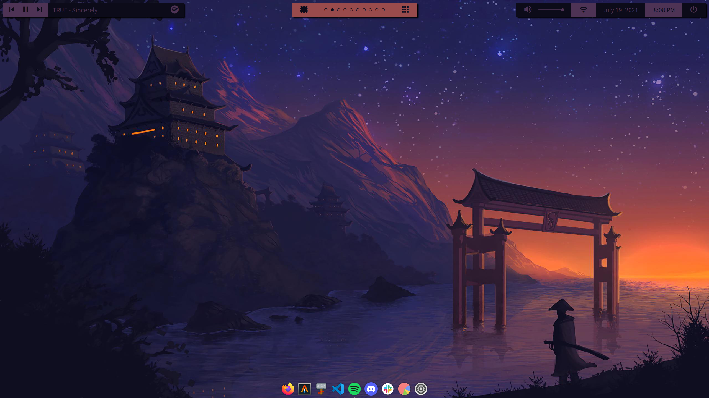
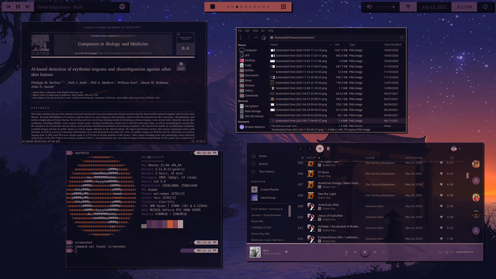
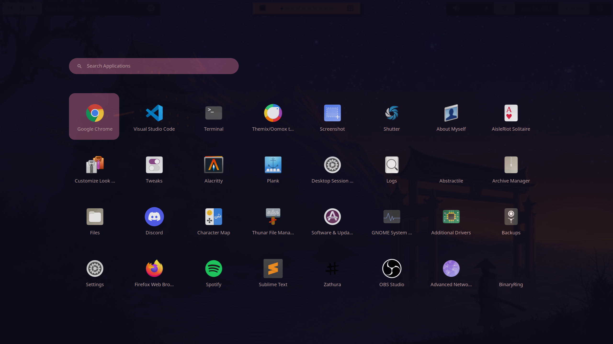
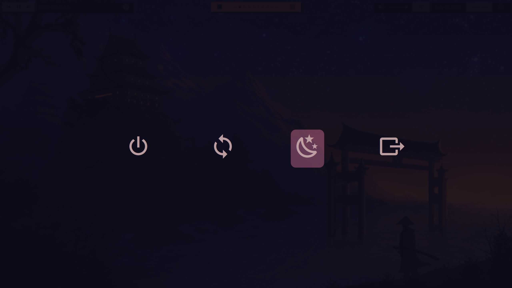

# Project Φ
*A product of hyperfixation, but damn it's nice*

# Screenshots









# Features
Project Φ was built around a few main pillars
* Usability - if it was a pain to use daily then I'd just stick with default Ubuntu
* Style - pretty obvious; needs to look swick
* Chameleon Criterion - be able to change your colors easily
* Easy to set up - basically I wanted as few steps as needed to get up and running from a fresh Ubuntu install

Now, is this free of any jank? Hell no! There's definitely a few things that just kind of are a bit scuffed, but I like to think it's scuffed in an endearing way, y'know? Basically, this is me saying a lot of it could maybe be tweaked to be a tad better, but it's not worth the effort for me since the scuffed parts don't show up all too much for me. 

# On the Chameleon Criterion
Since I wanted to make the colors swap with the wallpaper, there's a small process involved when one wants to use a different wallpaper.

*Note that the wallpaper must be a PNG file*

1) Change the wallpaper in the Settings app (aka gnome-control-center)
2) Reload bspwm (my shortcut is super + alt + R)
3) Run ```sh ~/.config/bspwm/regen-theme.sh``` for stuff like the gtk theme and spicetify

I'd like to combine steps 2 and 3 at some point, but any attempts to do so as of now have been fruitless

Yes, I can hear someone crying out that I should set the wallpaper a different way than gnome-control-center. My answer is that I couldn't honestly care less about doing it through command line or whatever, I simply prefer doing it with the app. With that said, it's a really simple modification to make it do something different: simply go into ```.config/bspwm/bspwmrc``` and change the ```WP_PATH``` variable to grab the wallpaper in whatever way you so desire. This would eliminate step 1, leaving steps 2 and 3 as the only things you'd need to run.

# Ingredients
The main components that give Project Φ its look are as follows:
* Ubuntu
* bspwm (window manager)
* pywal (colors)
* polybar (status bars)
* rofi (app launcher and power menu)
* oomox (for the gtk theme, colors again come from pywal)
* dunst (notifications)
* zsh (shell)

There are a bunch of other minor items like alacritty, spicetify, oh-my-zsh, etc. that complete Project Φ as well, but honestly I can't be bothered to just list out every little modification.

You may notice there's not really a lockscreen. Honestly I don't lock my personal computer all too much and trying to get one working was too much effort. In the future, if I find it necessary, I'd like to just use the same locking mechanism that gnome uses for default Ubuntu, but I really don't know how to get that working currently.

# Installation
This part's the fun bit, since I tried to make it as simple as possible (mostly for myself). The following steps should get everything sorted. 

Note that this assumes one is using Ubuntu 20.10 or later. If you're using another distro...figure it out then idfk lol.

Now, while it pains me to do this, I can't find a way to automate some of the fonts and the cursor, so we have to get them out of the way first

## Fonts and Cursor
The following items are needed for the rice to work:
* [Noto Sans](https://www.google.com/get/noto/#sans-lgc)
* [MesloLGS NF](https://github.com/romkatv/powerlevel10k#meslo-nerd-font-patched-for-powerlevel10k) (for powerlevel10k; download the 4 .ttf files in the link)
* Material Design Icons (handled in later steps, since it actually can be gotten through apt)
* [Sweet-cursors](https://www.gnome-look.org/p/1393084/) (cursor theme) 

## The Rice Cooker
Now for the fun part: the rice cooker. Follow these steps for glory.
1) Clone this repository
2) Run ```cd dotfiles```
3) Run ```rice-cooker.sh``` as root
4) Reboot and log back in to bspwm
5) Run ```sh ~/.config/bspwm/regen-theme.sh``` to get your theming all set up
6) Set gtk and cursor themes through lxappearance

While I'm certain this will break for some others, from my testing on a fresh install of Ubuntu, this should work perfectly fine.

# Acknowledgements
Aside from all the creators and contributors involved in the amazing softwares used in this rice, I have a few special thanks to give to some folks.

* Whoever made this post, you're a damn angel for helping me get started on this. https://www.reddit.com/r/unixporn/comments/feseh2/getting_started_with_bspwm_for_beginners/ 
  
* This repo was really helpful for understanding how to get rofi running https://github.com/karosamu/dotfiles
  
* I basically ripped the way I colored dunst with pywal from https://www.reddit.com/r/unixporn/comments/a7tnlv/i3gap_autogenerating_rice_via_pywal/?utm_source=share&utm_medium=web2x&context=3
  
* The polybar theme is pretty heavily inspired by the cherryblocks theme in https://github.com/kiddae/polybar-themes
  
* My rofi menus are honestly just tweaked versions of stuff in https://github.com/adi1090x/rofi

* Wallpaper used in screenshots: https://www.reddit.com/r/wallpaper/comments/j5frmj/the_lone_samurai_2560_x_1440/?utm_source=share&utm_medium=web2x&context=3
